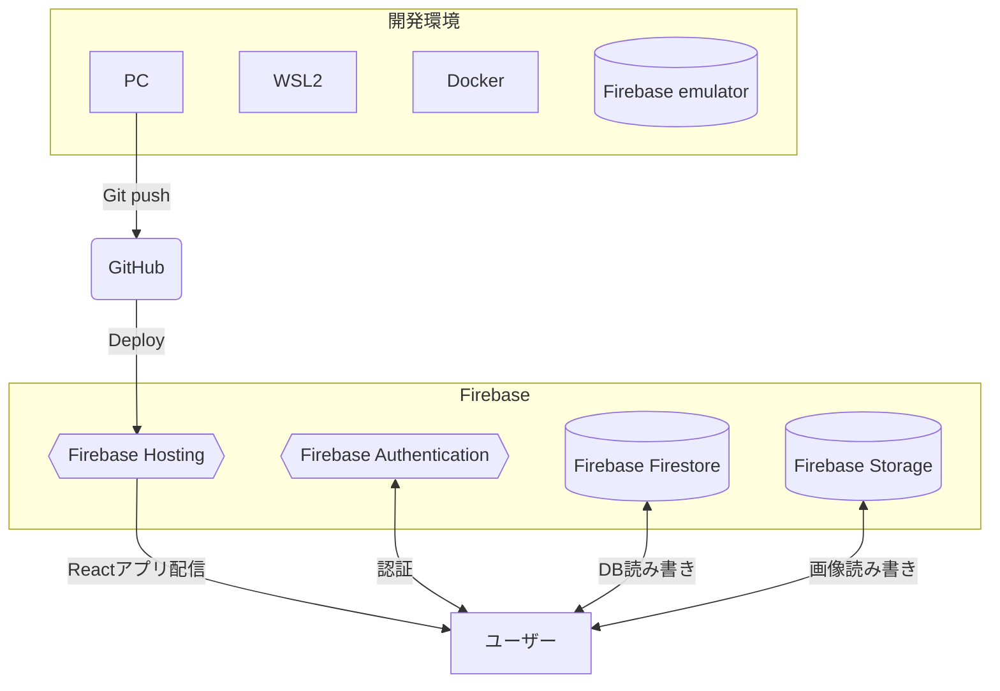

# Lite chat

React _ Firebase _ WebRTC を使用して、ランダムでマッチした相手とチャットやビデオ通話を楽しめるコミュニケーションサービスです。業務で Next.js を使用する事になったので React の知見を深める為の一環として自分のサービスを作成しました。題材にチャットサービスを選んだ理由は、[Gather](https://www.gather.town/)というサービスのセンスが好きで WebRTC 関連の技術に興味を持った事と、暇つぶし系のチャットアプリは沢山あるが、インストール型が主流で『暇つぶしチャットアプリに興味はあるけどインストールするのは抵抗がある』という層がいればそこそこ使って貰えるサービスになるのでは？と考えたからです。

 

 

## デモ URL

https://lite-chat.com?testUser=true

クエリに `testUser=true` をつけることでテストユーザーでサインインする事ができるボタンが表示されます。動作確認をする場合、以下の手順で実行して下さい。

1. Google chrome で https://lite-chat.com?testUser=true にアクセス。
2. `太郎サインイン` ボタンで太郎としてサインイン。
3. `Ctrl + Shift + N` 又は `⌘+shift+n` でシークレットモードのブラウザを用意し、https://lite-chat.com?testUser=true にアクセス。
4. `花子サインイン` ボタンで花子としてサインイン。
5. チャットやビデオ通話の機能をお試して頂けます。（他のユーザーに迷惑のかかる行為はご遠慮下さい。）

 

## 使用技術一覧

- React v18.2.0
  - Redux v8.0.5
  - React-router-dom v6.9.0
- Vite v4.2.0
- Vitest v0.30.1
- Typescript v4.9.3
- Material ui v5.11.14
- Sass v1.60.0
- Firebase v9.18.0
  - Authentication
  - Firestore
  - Storage
  - Hosting
- Docker 20.10.23
- Github actions

 

## アーキテクチャ

 

## 主な機能

- サインイン・サインアウト
- プロフィール作成・編集
- ランダムマッチング
- メッセージ読み書き
- ビデオ通話
